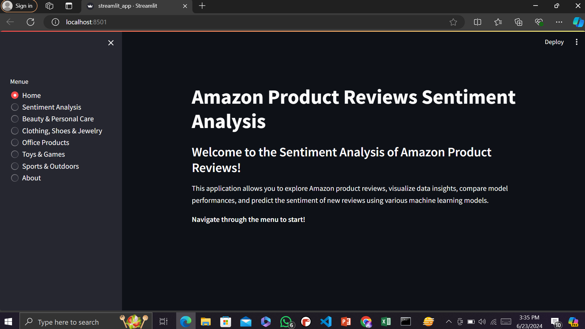

 # Amazon Products Sentiment Analysis Project

Welcome to the Amazon Products Sentiment Analysis Project! This project involves web scraping, data labeling, applying NLP techniques for sentiment analysis, data visualization, and building a frontend using Streamlit.

## Table of Contents

- [Introduction](#introduction)
- [Getting Started](#getting-started)
- [Project Workflow](#project-workflow)
  - [1. Web Scraping](#1-web-scraping)
  - [2. Data Labeling](#2-data-labeling)
  - [3. NLP Techniques for Sentiment Analysis](#3-nlp-techniques-for-sentiment-analysis)
  - [4. Data Visualization](#4-data-visualization)
  - [5. Frontend with Streamlit](#5-frontend-with-streamlit)
- [Future Scope](#6.Future-Scope)
- [Team & Acknowledgements](#acknowledgements)

## Introduction

This project is aimed at analyzing sentiment (positive, negative or neutral) from web-scraped data using Natural Language Processing (NLP) techniques. The project workflow includes the following steps:

1. Web scraping to gather data.
2. Labeling the web scraped data for sentiment analysis.
3. Applying NLP techniques to build a sentiment analysis model.
4. Visualizing the data and results.
5. Creating a frontend using Streamlit for interactive user experience.

## Getting Started

To get started with the project, follow the instructions in the requirements.txt. Ensure you have all the required dependencies installed.

## Project Workflow

### 1. Web Scraping

The first step in this project is to gather data through web scraping. We used Python libraries such as `Selenium` to scrape data from various websites. The scraped data includes product Name, Price, Availability, Brand, Description, Category, Rating, Review, Star, Date. For different products reviews are gathered. About 14 to 15 reviews for each product were gathered.
This data can be find in csv file `Amazon_reviews_dataset.csv`. Web scraping code can be found in `web_scraping.ipynb`.

### 2. Data Labeling

Once the data was scraped, the next step was to label the data. The labeling process involved categorizing each piece of text as positive, negative, or neutral. This labeled dataset is essential for training and evaluating our sentiment analysis model.
Labeling was done by two methods, using text blob and pre-trained Roberta model from hugging face. We used Roberta labeled data. Although you can also find text blob labeled data in `text_blob` folder.
The code for labeling by Roberta is in `label_roberta.py` and the labeled dataset is named as `Labeled-Amazon-Reviews-Dataset.csv`.

### 3. NLP Techniques for Sentiment Analysis

With the labeled dataset `Labeled-Amazon-Reviews-Dataset.csv`, we applied various NLP techniques to preprocess the data, including tokenization, lemmatization, and stop-word removal. As our nagative labels were very few compared to positive and neutral, we used oversampling and undersampling techniques. We then built and trained a sentiment analysis model using algorithms such as logistic regression, Random Forest, gradient boosting, SVM, light gbm and Ada boost.
We selected Light gbm as our final model based on evaluation measures. LightGBM is a gradient boosting framework that uses tree based learning algorithms.
`Nlp_sentiment_analysis_model.ipynb` is the jupyiter notebook having pre processing, model building and evaluation measures. Pickled model can be found in `model_LGBM.pkl`. Also, `tfidf_vectorizer.pkl` will be used when making prediction through frontend.

### 4. Data Visualization

To better understand the data and the results of our sentiment analysis, we created visualizations using libraries such as `Matplotlib` and `Seaborn`. These visualizations include rating distribution, sentiment distribution plots, and more, helping us to interpret the sentiment trends in the data.
`Labeled-Amazon-Reviews-Dataset.csv` is modified to `modified_file.csv` which is a cleaner version and will be used in frontend visualization. `Amazon_Reviews_Visualizations.ipynb` provides code and visualizations.
### 5. Frontend with Streamlit

Finally, we built a frontend for our project using Streamlit. The Streamlit app allows users (sellers of products) to interact with the sentiment analysis model, view visualizations, and input their own text to see the sentiment predictions. This makes our project accessible and user-friendly.
`streamlit_app.py` is file containing frontend code.Here, is a preview of frontend. For whole frontend pictures and video visit `frontend_pics&vid` folder.

### Future Scope
This project can be improved and enhanced on much larger scale. Some tips are:
- Use a larger dataset having fair representation from all sentiments.
- Use better models.
- Making it large scale and add product buyer point of view.

### Team & acknowledgements
Team members:
- `Eman Zahid` `BSDSF21A010`- Data Science student at PUCIT, Lahore.
- `Zobia Bilal` `BSDSF21A026`- Data Science student at PUCIT, Lahore.

We are cordially thankful to our teacher and all people who guided us in this project.

